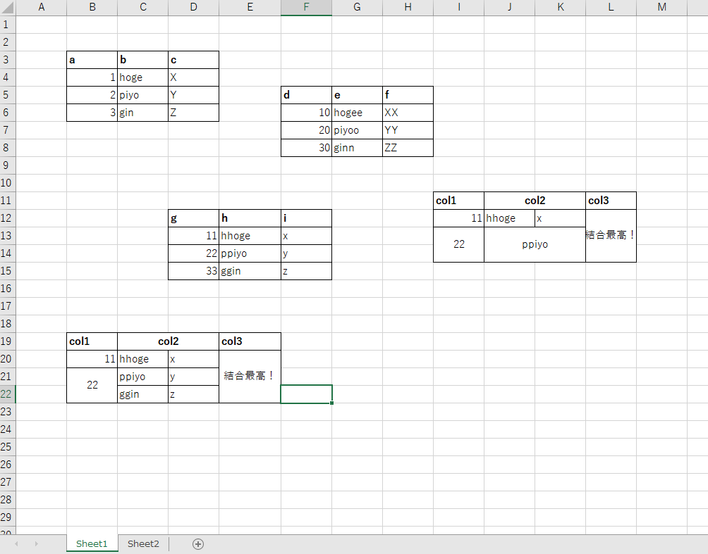
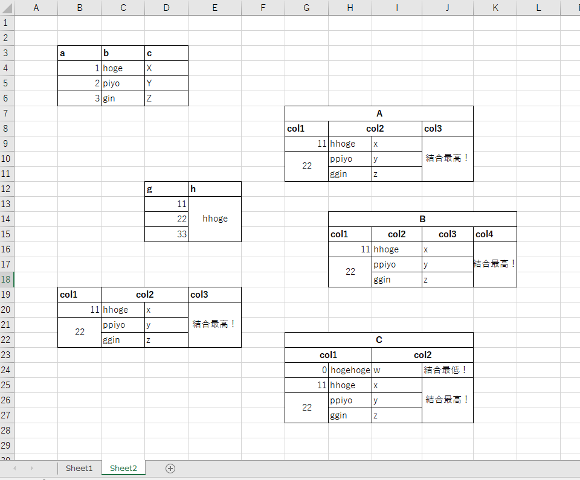
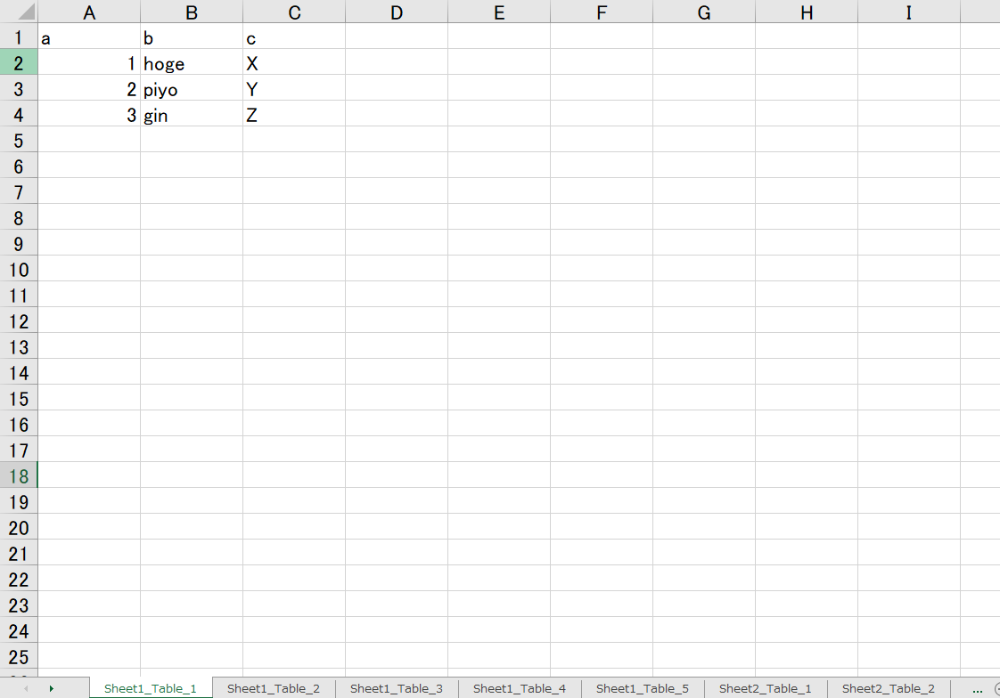
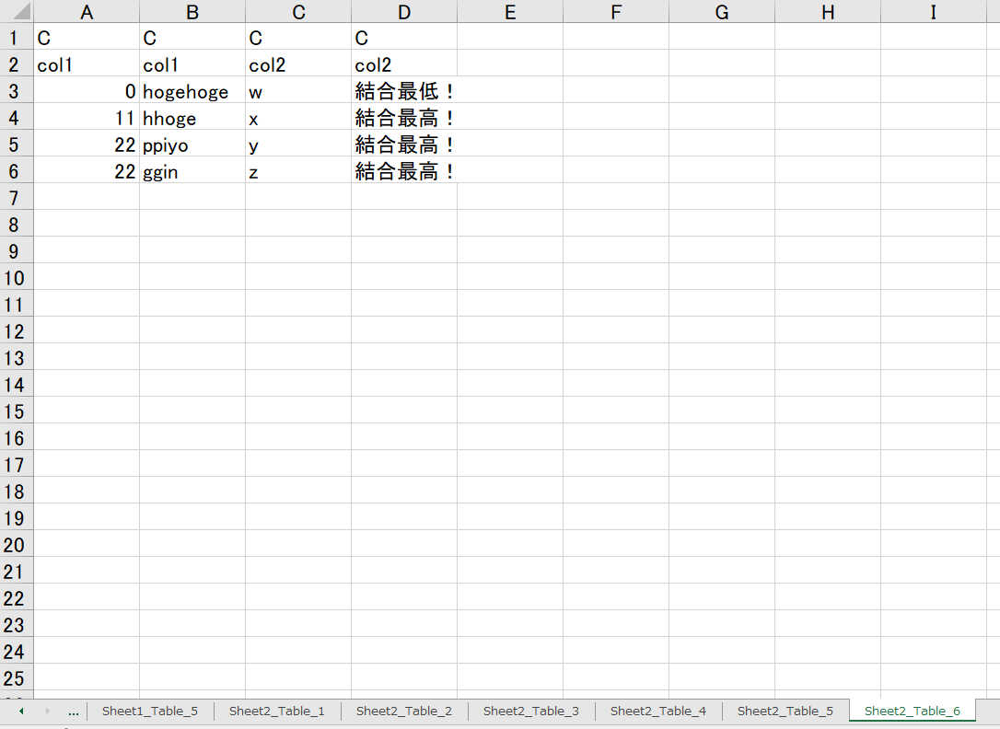

# Excelシートに散らばったテーブルを何とか処理できる形に整形する
## 概要
PythonやTabelauで遊んでいたある日、
とんでもないExcelデータが舞い込んできた。
openpyxlでしこしこ処理するのも面倒なので、
「何とか処理できる形に整形する」プログラムをChatGPT-4と書いた。

## input
信じられない品質のデータである。複数のシートにもまたがっている。

このままでは手に負えない。

## output
シート名は`[シート名]_[テーブル順]`であり、全てのテーブルがシートに割り当てられている。

なお結合テーブルは2枚目の通り変換される。

